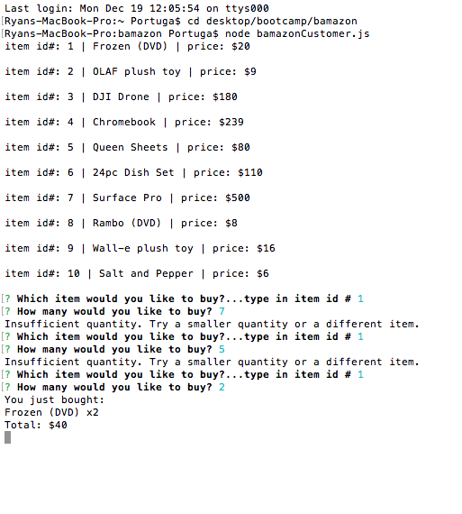
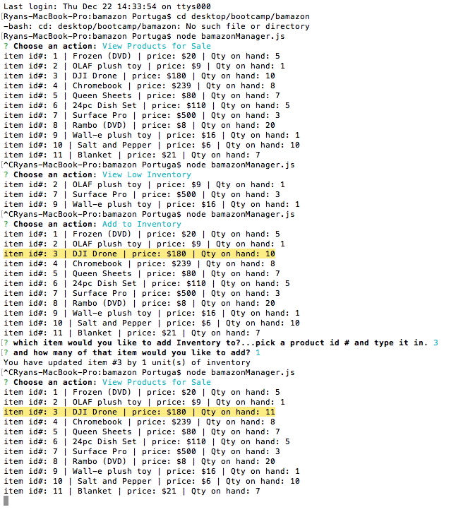
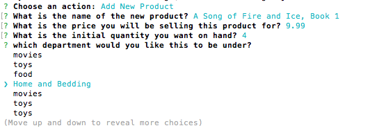
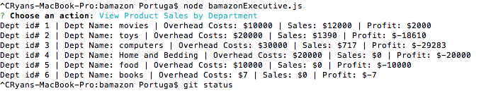
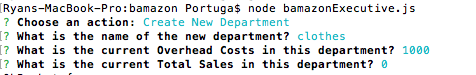

# bamazon
Bamazon, a MySQL project

Challenge #1: Customer View 

Create a MySQL Database called Bamazon.
Then create a Table inside of that database called products.
The products table should have each of the following columns:

* item_id (unique id for each product)

* product_name (Name of product)

* department_name

* price (cost to customer)

* stock_quantity (how much of the product is available in stores)

Populate this database with around 10 different products. (i.e. Insert "mock" data rows into this database and table).
Then create a Node application called bamazonCustomer.js. Running this application will first display all of the items available for sale. Include the ids, names, and prices of products for sale.

The app should then prompt users with two messages.
The first should ask them the ID of the product they would like to buy.
The second message should ask how many units of the product they would like to buy.
Once the customer has placed the order, your application should check if your store has enough of the product to meet the customer's request.

If not, the app should log a phrase like Insufficient quantity!, and then prevent the order from going through.
However, if your store does have enough of the product, you should fulfill the customer's order.
This means updating the SQL database to reflect the remaining quantity.
Once the update goes through, show the customer the total cost of their purchase.

************************************************************

************************************************************

Challenge #2: Manager View (Next Level)

Create a new Node application called bamazonManager.js. Running this application will:
List a set of menu options:
View Products for Sale
View Low Inventory
Add to Inventory
Add New Product
If a manager selects View Products for Sale, the app should list every available item: the item IDs, names, prices, and quantities.
If a manager selects View Low Inventory, then it should list all items with a inventory count lower than five.
If a manager selects Add to Inventory, your app should display a prompt that will let the manager "add more" of any item currently in the store.
If a manager selects Add New Product, it should allow the manager to add a completely new product to the store.

************************************************************

************************************************************

************************************************************

************************************************************

Challenge #3: Executive View (Final Level)

Create a new MySQL table called departments. Your table should include the following columns:
* department_id

* department_name

* over_ head_costs (A dummy number you set for each department)

* total_sales
Modify your bamazonCustomer.js app so that when a customer purchases anything from the store, the program will calculate the total sales from each transaction.
Add the revenue from each transaction to the total_sales column for the related department.
Make sure your app still updates the inventory listed in the products column.

Create another Node app called bamazonExecutive.js. Running this application will list a set of menu options:
View Product Sales by Department
Create New Department

When an executive selects View Product Sales by Department, the app should display a summarized table in their terminal/bash window. Use the table below as a guide.
department_id	department_name	over_head_costs	product_sales	total_profit
01	Electronics	10000	20000	10000
02	Clothing	60000	100000	40000

The total_profit should be calculated on the fly using the difference between over_head_costs and product_sales. total_profit should not be stored in any database. You should use a custom alias.

************************************************************

************************************************************

************************************************************

************************************************************

